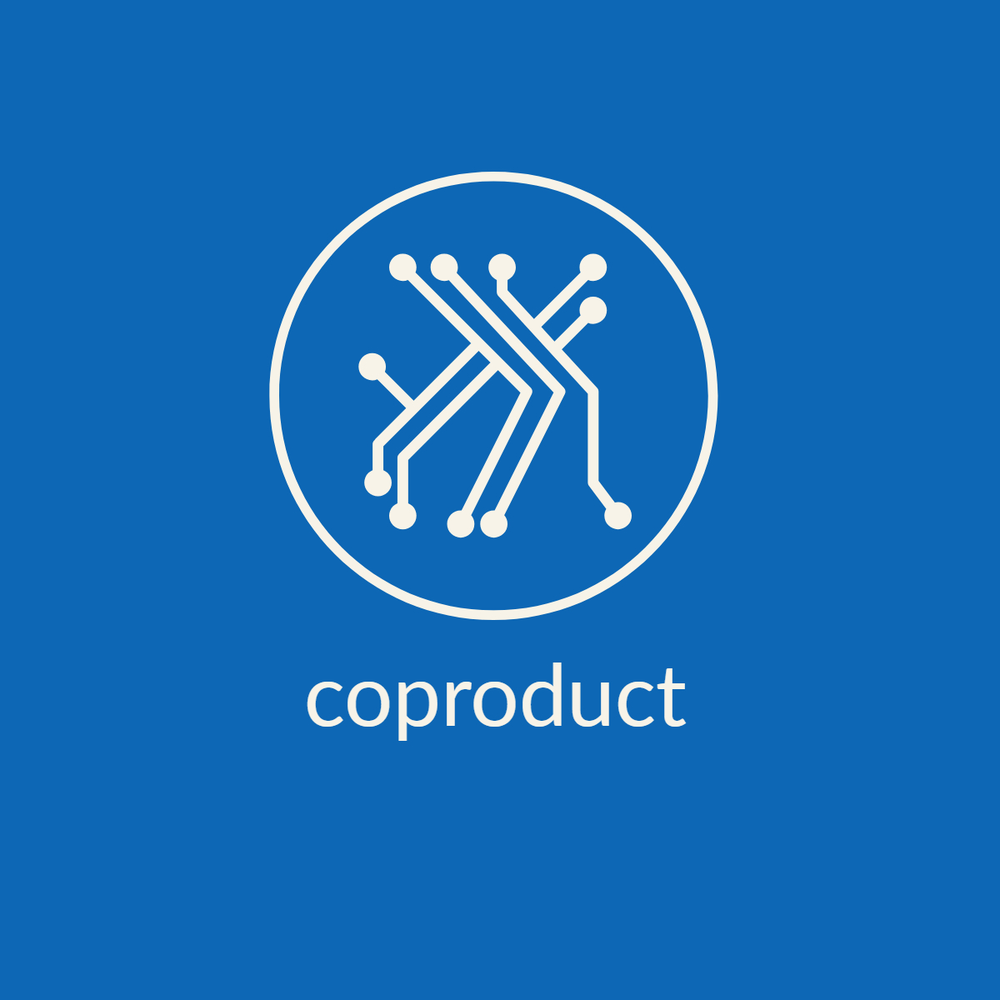

# coproduct

<p align="center">
  
</p>

[](https://www.npmjs.com/package/coproduct)

[](https://github.com/Lucifier129/coproduct#readme)
[](https://github.com/Lucifier129/coproduct/graphs/commit-activity)
[](https://github.com/Lucifier129/coproduct/blob/master/LICENSE)
[](https://twitter.com/guyingjie129)

> A small library aims to improve better tagged-unions/discriminated-unions supporting for TypeScript

## Benefits

- Small bundled size(just 1kb)
- Easy to use with just a few apis to learn
- Improving **Type-Safety** for your TypeScript project via exhaustive pattern-matching

## Installation

```shell
yarn add coproduct
npm install --save coproduct
```

## Usage

For redux app

```typescript
// state type
type CounterState = {
  count: number;
};

// action type
type CounterAction =
  | Tagged<'incre'>
  | Tagged<'decre'>
  | TaggedData<'increBy', number>
  | TaggedData<'decreBy', number>;

// reducer with match
const counterReducer = (
  state: CounterState,
  action: CounterAction
): CounterState => {
  return match(action).case({
    incre: () => ({
      ...state,
      count: state.count + 1,
    }),
    decre: () => ({
      ...state,
      count: state.count - 1,
    }),
    increBy: (value: number) => ({
      ...state,
      count: state.count + value,
    }),
    decreBy: (value: number) => ({
      ...state,
      count: state.count - value,
    }),
  });
};

// reducer without match
const counterReducer = (
  state: CounterState,
  action: CounterAction
): CounterState => {
  if (action.tag === 'incre') {
    return {
      ...state,
      count: state.count + 1,
    };
  } else if (action.tag === 'decre') {
    return {
      ...state,
      count: state.count - 1,
    };
  } else if (action.tag === 'increBy') {
    return {
      ...state,
      count: state.count + action.increBy,
    };
  } else if (action.tag === 'decreBy') {
    return {
      ...state,
      count: state.count - action.decreBy,
    };
  }

  throw new Error(`Unexpected action: ${action}`);
};
```

Basic usage

```typescript
import { Tagged, TaggedData, match } from 'coproduct';

export type Option<T> = TaggedData<'some', T> | Tagged<'none'>;

export const None = Tagged('none');
export const Some = TaggedData('some');

const show = <T>(data: Option<T>) => {
  return match(data).case({
    some: value => `some: ${value}`,
    none: () => 'none',
  });
};

const value0 = Some(1);
const value1 = None;

expect(show(value0)).toBe('some: 1');
expect(show(value1)).toBe('none');

// you can use if/else to match manually if you want
const show = <T>(data: Option<T>) => {
  if (data.tag === 'some') {
    return `some: ${data.some}`;
  } else if (data.tag === 'none') {
    return 'none';
  }
  throw new Error(`Unexpected data: ${data}`);
};
```

You don't need to define your own `option type`, coproduct has built-in `Option` and `Result`.

```typescript
import { match, Option, Some, None, Result, Ok, Err } from 'coproduct';

const show = <T>(data: Option<T>) => {
  return match(data).case({
    some: value => `some: ${value}`,
    none: () => 'none',
  });
};

expect(show(Some(1))).toBe('some: 1');
expect(show(None)).toBe('none');

const showResult = <T>(result: Result<T>) => {
  return match(result).case({
    ok: value => `ok: ${value}`,
    err: value => `err: ${value}`,
  });
};

expect(showResult(Ok(1))).toBe('ok: 1');
expect(showResult(Err('error'))).toBe('err: error');
```

## Api

### Tagged(string)

`Tagged(tag)` return a tagged object with `{ tag: tag }` structure. It's useful for nullary case.

### TaggedData(string)

`TaggedData(tag)` return a factory function with `(data: T) => TaggedData<tag, T>` signature. It's useful for the case that carried data

### match(data).case(patterns)

`match(data).case(patterns)` perform `exhaustive pattern-matching` for data, every case in `data` should has its own visitor function.

**Note**: you can use `_: () => R` as default handler for unmatched case.

### match(data).partial(patterns)

`match(data).partial(patterns)` perform `non-exhaustive pattern-matching` for data. If `data` has no handler, it will throw an error.

**Note**: you can use `_: () => R` as default handler for unmatched case.

### Some(value)

`Some(value)` return the value with the `Some<T>` case of `Option Type`.

### None

`None` is the value with the `None` case of `Option Type`

### Ok(value)

`Ok(value)` return the value with the `Ok<T>` case of `Result Type`.

### Err(message)

`Err(message)` return the value with the `Err<E>` case of `Result Type`.

## Caveats

- The symbol `_` can't be used as a tag name since it's a reserved filed in `coproduct` as placeholder for `default` case.

## Contribution Guide

```shell
# test
npm run test

# build
npm run build
```

## Author

👤 **Jade Gu**

- Twitter: [@guyingjie129](https://twitter.com/guyingjie129)
- Github: [@Lucifier129](https://github.com/Lucifier129)

## 🤝 Contributing

Contributions, issues and feature requests are welcome!

Feel free to check [issues page](https://github.com/Lucifier129/coproduct/issues).

## Show your support

Give a ⭐️ if this project helped you!

## 📝 License

Copyright © 2022 [Jade Gu](https://github.com/Lucifier129).

This project is [MIT](https://github.com/Lucifier129/coproduct/blob/master/LICENSE) licensed.
